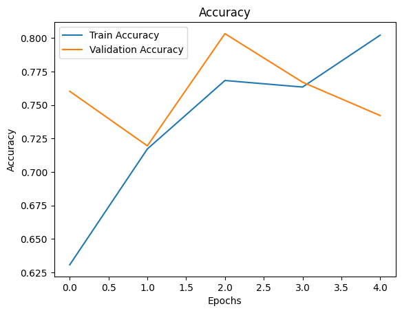
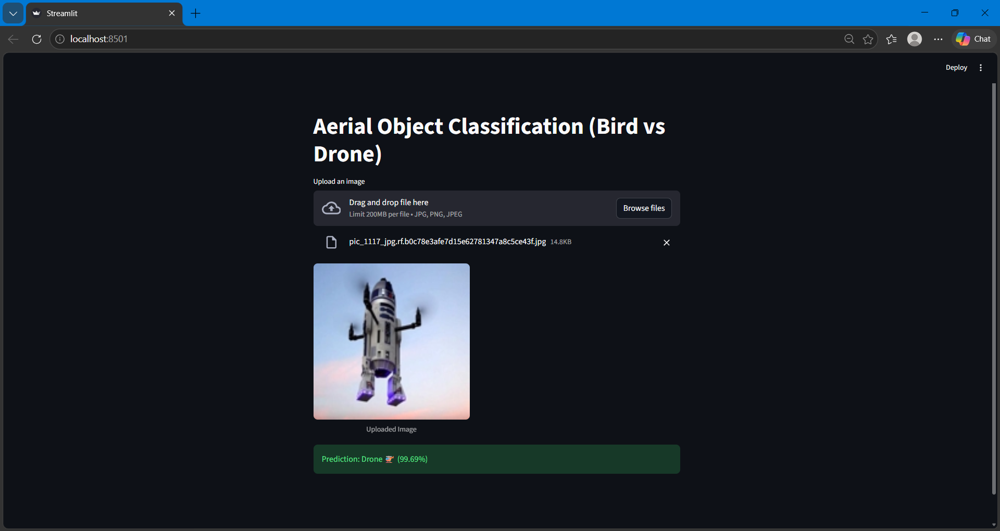

# Aerial Image Classification (Bird vs Drone) using Deep Learning

## 📌 Overview

This project implements a deep learning-based system to classify aerial images into **Bird** and **Drone** categories using CNN and MobileNetV2. The final model is deployed using Streamlit for real-time predictions.

---

## 🚀 Features

* Image classification using CNN and Transfer Learning
* Achieved **95% accuracy** using MobileNetV2
* Data augmentation for better generalization
* Streamlit web app for real-time predictions

---

## 🧠 Models Used

### 🔹 Custom CNN

* Accuracy: ~85%
* Moderate performance

### 🔹 MobileNetV2 (Transfer Learning)

* Accuracy: ~95.35%
* Best-performing model

---

## 📊 Results

### Accuracy Graph



### Streamlit Output



---

## 🧪 Evaluation

* Precision, Recall, F1-score
* Confusion Matrix

---

## 🖥️ Deployment (Streamlit)

Run the app locally:

```bash
streamlit run app.py
```

Upload an image and get prediction (Bird 🐦 / Drone 🚁)

---

## 📂 Dataset

Dataset used:

* Classification dataset (Bird vs Drone)
* https://drive.google.com/drive/folders/1nn1vqsh8juhafkJcleembrjQ9EqtIoMh?usp=sharing


---

## ⚙️ Tech Stack

* Python
* TensorFlow / Keras
* Streamlit
* Scikit-learn

---

## 🔮 Future Scope

* Implement YOLOv8 for object detection
* Real-time video classification
* Cloud deployment

---

## 👨‍💻 Author

Sukalp Warhekar
